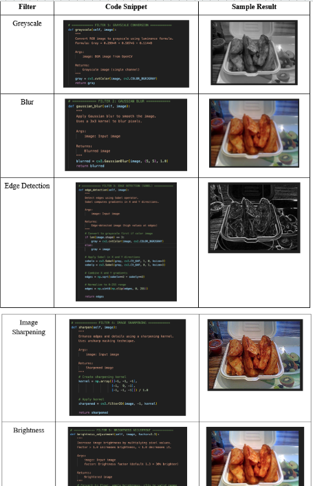
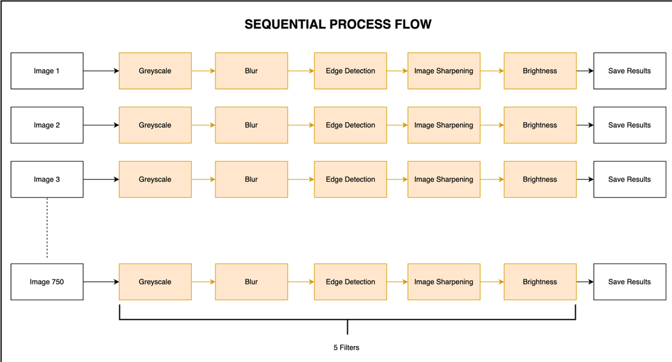
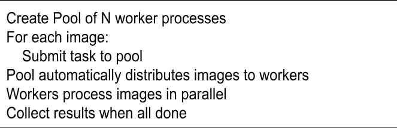
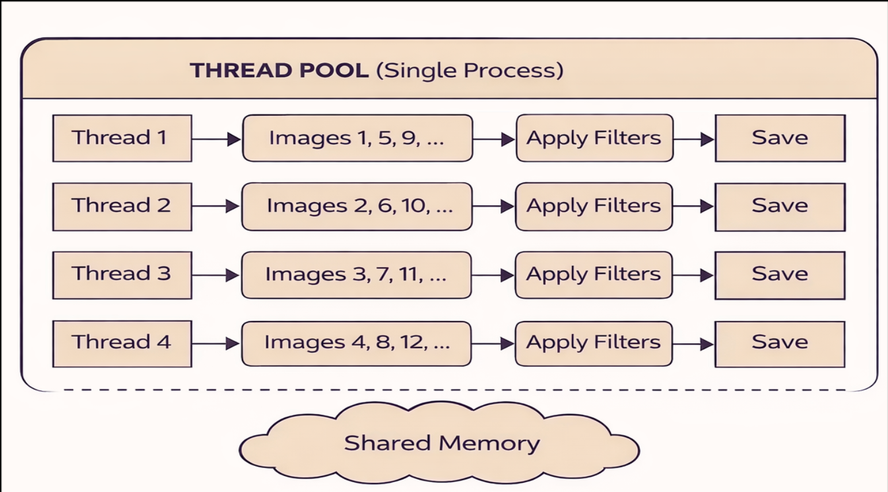
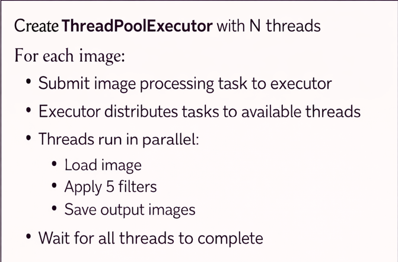

## Overview
This project implements a parallel image processing system that applies 5 different filters to images from the Food-101 dataset using two Python parallel paradigms: **multiprocessing** and **concurrent.futures**, benchmarked on Google Cloud Platform.

## Dataset
[Food-101 Dataset (Kaggle)](https://www.kaggle.com/datasets/dansbecker/food-101) — a subset of 750 images across 75 food categories (10 images per category) was used for testing.

## Filters Implemented
1. Grayscale Conversion (luminance formula)
2. Gaussian Blur (3×3 kernel)
3. Edge Detection (Sobel operator)
4. Image Sharpening (unsharp masking kernel)
5. Brightness Adjustment


*Sample output: Sobel edge detection applied to a Food-101 image (see Table 1 in the report for all 5 filters).*

## Implementations
- **Sequential** (`src/sequential_processor.py`) — baseline, processes images one at a time.
- **Multiprocessing** (`src/multiprocessing_processor.py`) — `multiprocessing.Pool`, N separate OS processes, avoids the GIL entirely.
- **Concurrent.futures** (`src/concurrent_processor.py`) — `ThreadPoolExecutor`, N threads sharing memory within one process; benefits from OpenCV/I/O releasing the GIL.

### Sequential Process Flow


### Multiprocessing Process Flow



### Concurrent.futures (Thread Pool) Process Flow



## Test Environment (GCP)
- **Machine Type:** e2-standard-8 (8 vCPUs, 32 GB RAM)
- **OS:** Debian GNU/Linux 12 (bookworm)
- **Dataset:** 750 images, Food-101 subset

## Performance Results

**Sequential baseline:** 22.03 seconds

### Multiprocessing (GCP)

| Processes | Time (s) | Speedup | Efficiency |
|---|---|---|---|
| 2 | 13.35 | 1.65x | 82.5% |
| 4 | 8.78  | 2.51x | 62.7% |
| 8 | 6.52  | 3.38x | 42.2% |

### Concurrent.futures (GCP)

| Threads | Time (s) | Speedup | Efficiency |
|---|---|---|---|
| 2 | 8.79 | 2.50x | 125.0% |
| 4 | 6.07 | 3.63x | 90.7%  |
| 8 | 5.79 | 3.80x | 47.5%  |

### Key Findings
- **concurrent.futures consistently outperformed multiprocessing** at every worker count on GCP — at 4 workers, it was ~26% faster (6.07s vs 8.78s), since thread creation overhead is lower than process creation overhead, and OpenCV/file I/O release Python's GIL.
- **4 workers is the optimal configuration** for both paradigms on this hardware — speedup gains diminish sharply beyond that point (multiprocessing: +35% from 4→8 workers; concurrent.futures: only +5%).
- Results align with **Amdahl's Law**: the practical ceiling of ~3.5–3.8x speedup implies roughly 18–20% of the workload is inherently sequential and cannot be parallelized.

**Recommended configuration:** `concurrent.futures` with 4 threads — best balance of speed (3.63x), efficiency (90.7%), and implementation simplicity.

## Usage

### Sequential Version
```bash
python src/sequential_processor.py
```

### Multiprocessing Version
```bash
python src/multiprocessing_processor.py
```

### Concurrent.futures Version
```bash
python src/concurrent_processor.py
```

## Project Structure
```
cst435_assignment2/
├── src/
│   ├── extract_subset.py              # Food-101 dataset extraction
│   ├── sequential_processor.py         # Sequential implementation
│   ├── multiprocessing_processor.py    # Multiprocessing implementation
│   └── concurrent_processor.py         # Concurrent.futures implementation
├── assets/                             # All report diagrams & sample images
│   ├── sequential-flow.png             # Figure 1
│   ├── multiprocessing-flow.png        # Figure 3
│   ├── multiprocessing-logic.png       # Figure 4
│   ├── threadpool-flow.png             # Figure 5
│   ├── threadpool-logic.png            # Figure 6
│   └── edge-detection-sample.png       # Table 1 sample result
├── images/                             # Extracted images (not in repo)
├── results/                            # Processed images (not in repo)
└── README.md
```

## Demo
<!-- demo link:https://drive.google.com/file/d/12OuT30UOFDP0CUQCgoSuCZww2db8MBXB/view?usp=sharing ...) -->

